= The Calm Window Manager (CWM)
Authored by me
:description: setup for a minimalist interface.
:url-repo: https://github.com/pguerin3/cwmrc
:url-adoc: https://docs.gitlab.com/ee/user/asciidoc.html
:icons: font
:hide-uri-scheme:

// https://docs.gitlab.com/ee/user/asciidoc.html
// Note: It’s possible to generate diagrams and flowcharts from text in GitLab using Mermaid or PlantUML.

== A minimalist floating window manager that also tiles

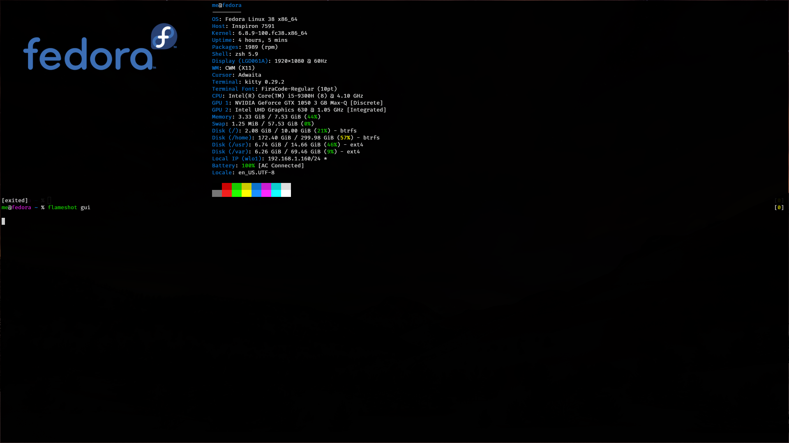

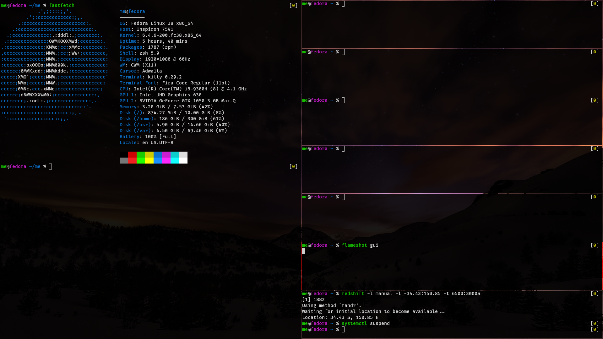

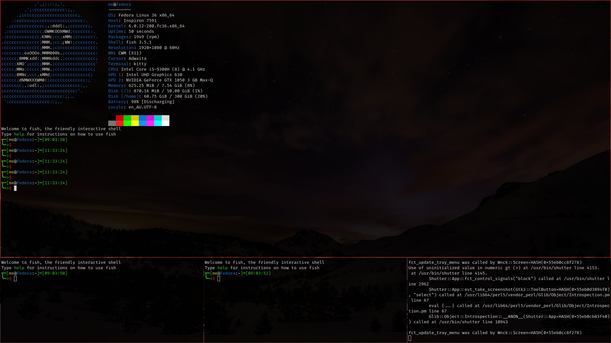

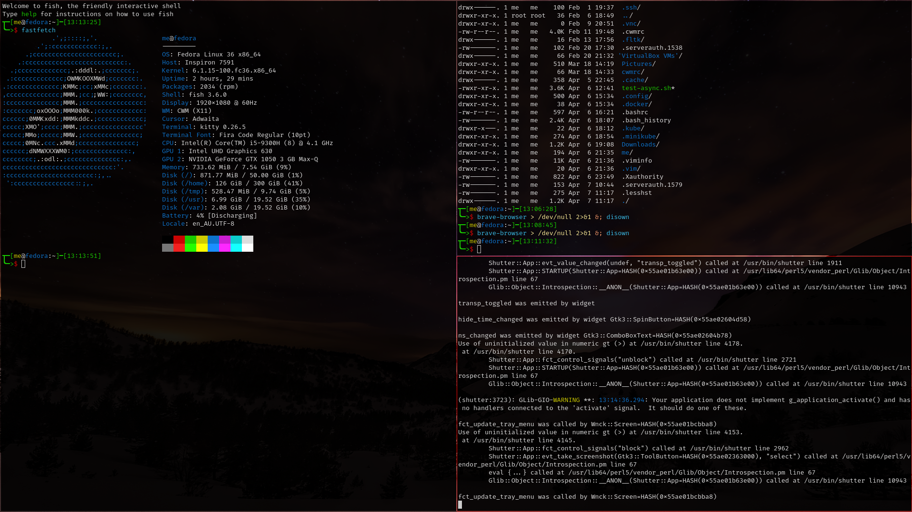

This repository showcases configuration of the Calm Window Manager (CWM)
to keep the minimal asthetic, but at the same time make more practical.

CWM is a minimalist floating window manager:

[x] float windows by default.
[x] snap any window into a corner, or edge of the screen.
[x] snap the floating windows into a tiling configuration. eg either
horizontal master/stack, or vertical master/stack.
[x] retain gaps between the windows and the edge of the screen.

Also there is also a native application launcher that you can drive with
the mouse or touchpad. eg use the keyboard to launch applications.

If the native application launcher is not to your liking, then it's easy
to add 3rd-party lanchers and status bars. eg Polybar.

As CWM doesn't feature multi-monitor support, the ideal use-case is that
you are just using a single monitor.

// thematic break (aka horizontal rule)
---

=== Screenshots of floating windows that are snapped into tiles

To create a few terminal windows, use alt+cntrl+enter for each terminal.

==== Without a Polybar:

For example, 4 floating windows can be snapped into tiles.

Then alt+cntrl+minus to tile the 4 windows, into a master window on the
left and 3 stacked windows on the right.

Then in the tiled layout, to switch the active window (in the
non-primary) with the primary position - simply alt-cntrl-minus again.

image:images/VirtualBox_Fedora35_23_04_2022_18_33_47.png[4 tiled windows
snapped with alt+cntrl+minus]

Use alt+cntrl+enter to create another terminal.

It will float on top of the 4 other windows for a total of 5 windows.

image:images/VirtualBox_Fedora35_23_04_2022_21_10_02.png[5 windows]

Then alt+cntrl+minus to restacck the 5 windows into the tiled layout
with the focused window placed in the master position on the left.

image:images/VirtualBox_Fedora35_23_04_2022_21_10_51.png[5 tiled
windows]

So now 4 windows have been snapped into the stack on the right, and the
focused window at that time was snapped into the master position on the
left.

The tiled windows can also be restacked with alt+cntrl+shift+minus, so
the master is now on top.

=== Screenshots of floating windows (without tiling)

image:images/VirtualBox1.png[screenshot1]

image:images/VirtualBox2.png[screenshot2]

image:images/VirtualBox3.png[screenshot3]

image:images/VirtualBox4.png[screenshot4]

image:images/VirtualBox5.png[screenshot5]

image:images/VirtualBox6.png[screenshot6]

image:images/VirtualBox7.png[screenshot7]

=== Screenshots with the native application launcher

The application laucher can be run with a mouse click.

image:images/VirtualBox10.png[native-luancher1]

image:images/VirtualBox11.png[native-luancher2]

Or you may run applications from the shell. For example:

[source, bash]
....
chromium-browser&
....

or to ignore any run-time errors:

[source, bash]
....
chromium-browser > /dev/null 2>&1 &
....

Add the disown command to detach the application from the terminal:

[source, bash]
....
chromium-browser > /dev/null 2>&1 & disown
....

As systemd is used, managing the host from the shell can also be
achieved with the following commands:

[source, bash]
....
systemctl suspend
....

[source, bash]
....
systemctl reboot
....

[source, bash]
....
systemctl poweroff
....

// thematic break (aka horizontal rule)
---

== Installation and configuration of CWM

The official repo for CWM is here:

https://github.com/leahneukirchen/cwm

Most Linux distributions have the CWM in their repository. So installing
CWM is extremely easy. For example, to install in Fedora:

[source, bash]
....
sudo dnf install cwm 
....

For Debian:

[source, bash]
....
sudo apt-get install cwm
....

For Arch:

[source, bash]
....
sudo pacman -S cwm
....

FreeBSD also has CWM in their repository, and is installed as follows:

[source, bash]
....
sudo pkg install cwm
....

The ~/.cwmrc configuration file used in the screen shots is similar to
this:

[source]
....
# CMS-r = restart
# these fonts are for the application launcher menu
#fontname fixed-13
fontname fixed-11

moveamount 10	# granularity of finest movement
vtile 50
htile 75
gap 1 1 1 1
color activeborder red
color inactiveborder black
snapdist 3

bind-key CM-Return  "kitty"
bind-key CM-minus   window-vtile
bind-key CMS-minus  window-htile

autogroup 1 kitty,kitty
autogroup 2 urxvt,URxvt
autogroup 3 brave-browser, Brave-browser
autogroup 4 chromium-browser,Chromium-browser
autogroup 6 "VirtualBox Manager", "VirtualBox Manager"
autogroup 7 "VirtualBox Machine", "VirtualBox Machine"
autogroup 8 "vncviewer", "Vncviewer"

bind-key M-1 group-toggle-1
bind-key M-2 group-toggle-2
bind-key M-3 group-toggle-3
bind-key M-4 group-toggle-4
bind-key M-5 group-toggle-5
bind-key M-6 group-toggle-6
bind-key M-7 group-toggle-7
bind-key M-8 group-toggle-8
bind-key M-0 group-toggle-all

#ignore polybar

# for the native application menu
command xscreensaver	"xscreensaver"
command urxvt   "urxvt"
command kitty   "kitty"
command top-green   "urxvt +sb -depth 32 -bg rgba:1111/1111/1111/9999 -fg [100]green -e top"
command top     "urxvt +sb -depth 32 -bg rgba:0000/0000/0000/6666 -fg [100]cyan -e top"
command vim		"urxvt -e vim ."

....

Inspect the CWM manual for all the default key bindings:

[source, bash]
....
man cwm
....

Then inspect the CWM configuration manual for the other possibilities
for the ~/.cwmrc file:

[source, bash]
....
man cwmrc
....

// thematic break (aka horizontal rule)
---

== Applications

=== System information with Fastfetch

Also as an option, install Fastfetch for some bling when a terminal is
started. The source is here:
https://github.com/LinusDierheimer/fastfetch

Fastfetch is present in the Fedora repo:

[source, bash]
....
sudo dnf install fastfetch
....

This is what Fastfetch looks like on Fedora.

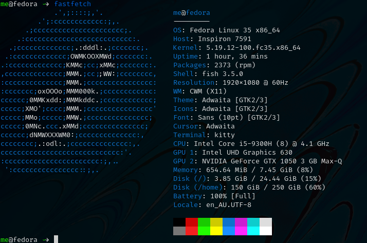

However I can also use an actual image for the graphic, if I download a suitable
image like as follows:

https://fedoraproject.org/wiki/File:Fedora_logo.png

Then I can call Fastfetch to use the image.

[source, bash]
....
fastfetch --logo-type kitty --logo-width 60 --logo ~/Downloads/Fedora_logo.png
....

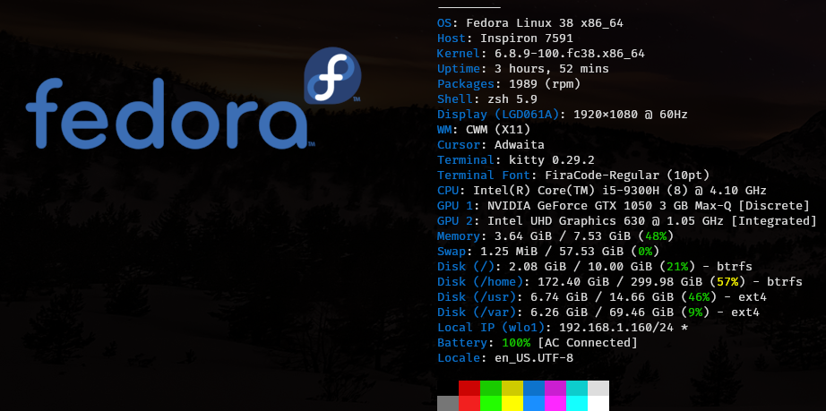

=== The virtual terminal with Urxvt

Urxvt is present in the Fedora repo:

[source, bash]
....
sudo dnf install rxvt-unicode 
....

My urxvt terminal is configured without scroll bars. Also use
shift-pageup to scroll up, and shift-pagedown to scroll down. The +ssr
parameter of urxvt turns off secondary screen scroll, so for example
text inside the Vim editor will not be shown in the primary window after
Vim has exited. The same setting is set with secondaryScroll.

Create a ~/.Xdefaults file for the configuration of the urxvt terminal.
Place the following configuration in it:

[source]
....
URxvt.scrollBar: off
# turn off the secondary screen scrolling for a pager. eg less.
URxvt.secondaryScroll: off
URxvt.depth: 32
# black (0000/0000/0000) with no transparency (ffff)
# grey (1111/1111/1111) with no transparency (ffff)
URxvt.background: rgba:0000/0000/0000/ffff
URxvt.foreground: [100]grey
URxvt.font: xft:monospace:pixelsize=12
URxvt.geometry: 132x50
URxvt.visualBell: on
....

=== The virtual terminal with Kitty

Kitty is in the Fedora repo:

[source, bash]
....
sudo dnf install kitty
....

My Kitty terminal is configured without scroll bars. Also use
cntrl-shift-pageup to scroll up, and cntrl-shift-pagedown to scroll
down. In Kitty, secondary screen scrolling is off by default.

Also define the font and font size you want to use with the Fish shell.
In the config above I'm using FiraCode:
https://github.com/tonsky/FiraCode

[source, bash]
....
sudo dnf install fira-code-fonts
....

Kitty can autocreate a default configuration file in
~/.config/kitty/kitty.conf by using ctrl+shft+f2. Or you can maually
create a configuration file yourself in the same location.

Then you can add configurations to the head of the file similar to as
follows:

[source]
....
remember_window_size no
initial_window_width  1000
initial_window_height 1000
hide_window_decorations yes
background_opacity 0.9
dynamic_background_opacity yes
scrollback_fill_enlarged_window yes
focus_follows_mouse yes
# dnf install fira-code-fonts
font_family Fira Code Regular
font_size 10
enable_audio_bell no
visual_bell_duration 0.1
editor nvim
....

=== Terminal shell with Zsh

The Zsh shell is pretty plain out-of-the box but can be configured easily enough.

Unlike Fish, Zsh as a vim mode so you can escape and then use the vim key 
bindings to help you edit a command.

Install the Zsh shell as follows:

[source, bash]
....
sudo dnf install zsh zsh-autosuggestions zsh-syntax-highlighting
....

Compared with Fish, there are less features out-of-the-box, so Zsh
should be setup with a configuration file up-front. Create a default
~/.zshrc file with the following contents:

[source, zsh]
....
# Lines configured by zsh-newuser-install
HISTFILE=~/.histfile
HISTSIZE=1000
SAVEHIST=1000
setopt autocd beep extendedglob nomatch notify
bindkey -v
# End of lines configured by zsh-newuser-install
# The following lines were added by compinstall
zstyle :compinstall filename '/home/me/.zshrc'
autoload -Uz compinit
compinit
# End of lines added by compinstall

alias ls='ls --color=auto --group-directories-first -v'
#Seems to be more colourful without the following
#LS_COLORS='di=1:fi=0:ln=31:pi=5:so=5:bd=5:cd=5:or=31:mi=0:ex=35:*.rpm=90'
#export LS_COLORS

# ZSH uses the ZSH line editor (ZLE) but in Bash can use cntrl-x cntrl-e
# in Tmux, EDITOR can set the vi mode key bindings. ie mode-keys and status-keys.
# Note: the following works if the command line is still in insert mode
EDITOR=nvim
autoload -U edit-command-line; 
zle -N edit-command-line; 
bindkey '^x^e' edit-command-line;

setopt autocd
setopt correctall

# removes copies of lines still in the history list, keeping the newly added one
setopt HIST_IGNORE_ALL_DUPS

# Show the man page in Neovim
export MANPAGER='nvim +Man!'

# execute fastfetch only on the zsh login shell
# Will be named: /dev/tty1
# download image: https://fedoraproject.org/wiki/File:Fedora_logo.png
if [[ $0 = -zsh ]]; then 
  fastfetch
fi

# execute only on the first TTY created
# /dev/pts/0
if [[ $TTY = /dev/pts/0 ]]; then
  fastfetch --logo-type kitty --logo-width 60 --logo ~/Downloads/Fedora_logo.png
  redshift -l manual -l -34.43:150.85 -t 6500:3000&
  ~/./battery.sh&
  jobs
  cd ~/me; ls -lhalr; git pull
fi

# execute only on the second TTY created
# /dev/pts/1
if [[ $TTY = /dev/pts/1 ]]; then
    tmux
fi

autoload -Uz promptinit
promptinit

prompt walters
PROMPT='%F{green}%n%f@%F{magenta}%m%f %F{blue}%B%~%b%f %# '
RPROMPT='[%F{yellow}%?%f]'

# perhaps a better syntax highlighting
#Clone the Repository.
#git clone https://github.com/zdharma-continuum/fast-syntax-highlighting ~/usr/share
#And add the following to your zshrc file.
source ~/usr/share/fast-syntax-highlighting.plugin.zsh

source /usr/share/zsh-autosuggestions/zsh-autosuggestions.zsh
# Note: zsh-syntax-highlighting is supposed to be at the end of the .zshrc file
#ZSH_HIGHLIGHT_HIGHLIGHTERS+=(brackets pattern cursor)
#source /usr/share/zsh-syntax-highlighting/zsh-syntax-highlighting.zsh

....

There are a number of native command prompt themes available, and they
can be listed with :

[source, bash]
....
prompt -p
....

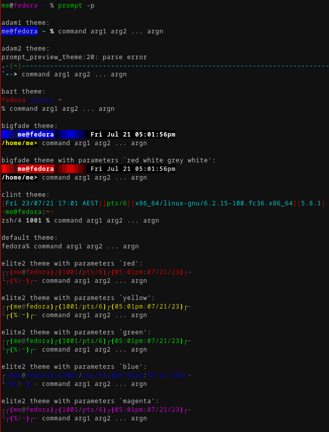

An example of a basic Zsh command prompt theme (eg walters) is below:

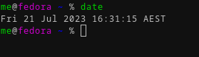

=== An interactive shell with Fish

The Fish shell has syntax highlighting out-of-the box with a selection of prompts and
colour themes. Install the Fish shell as follows:

[source, bash]
....
sudo dnf install fish 
....

The ~/.config/fish/config.fish file is like this:

[source, fish]
....
if status is-interactive
    # Commands to run in interactive sessions can go here
    # add color to the less pager in Fish, not Bash does this differently using export.
    set -gx LESS_TERMCAP_mb (printf '\e[01;31m') # enter blinking mode - red
    set -gx LESS_TERMCAP_md (printf '\e[01;35m') # enter double-bright mode - bold, magenta
    set -gx LESS_TERMCAP_me (printf '\e[0m') # turn off all appearance modes (mb, md, so, us)
    set -gx LESS_TERMCAP_se (printf '\e[0m') # leave standout mode
    set -gx LESS_TERMCAP_so (printf '\e[01;33m') # enter standout mode - yellow
    set -gx LESS_TERMCAP_ue (printf '\e[0m') # leave underline mode
    set -gx LESS_TERMCAP_us (printf '\e[04;36m') # enter underline mode - cyan
end
#Note - same what may be found in a Bash configuration file except the $ is removed.

#Add your favourite keyboard layout here for X11
#setxkbmap -layout us -variant <name>

# Now it's your choice of fastfetch for every terminal
#fastfetch
# or fastfetch just for the 1st terminal (fish syntax)
set -l LIVE_COUNTER $(ps a -o tty $(pgrep $(echo $TERM)) | uniq --unique | wc -l)
if [ $LIVE_COUNTER -eq 1 ]
     fastfetch
end
....

The theme and prompt can also be selected from the native
configurations. Display a list of Fish themes with:

[source, fish]
....
fish_config theme show
....

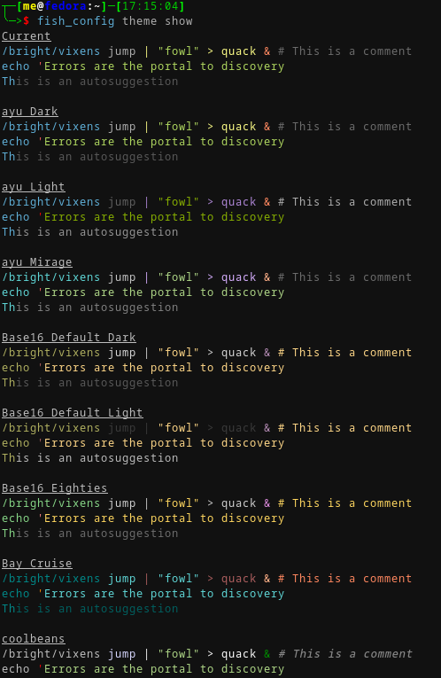

Then choose a Fish theme like this:

[source, fish]
....
fish_config theme choose 'ayu Dark'
fish_config theme save 'ayu Dark'
....

Similarly display a list of Fish prompts with:

[source, fish]
....
fish_config prompt show
....

And choose a Fish prompt like this:

[source, fish]
....
fish_config prompt choose nim
fish_config prompt save
....

An example of the 'ayu Dark' theme with a 'nim' prompt is below:

image:images/fish0001.png[image]

If you are running a job in the background then it will be shown.

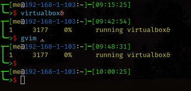

When no jobs are present then the normal prompt returns.

=== Window transparency with Picom

Transparency in the terminal is enabled in the terminal, but the
transparency itself is performed by Picom:

[source, bash]
....
sudo dnf install picom
....

=== Status bar with Polybar

Status bar can be provided by Polybar:

[source, bash]
....
sudo dnf install polybar
....

In the Fedora repo there is an example config file installed by default:
/usr/share/doc/polybar/examples/config.ini

However this file can be copied to: ~/.config/polybar/config.ini

[source, bash]
....
mkdir ~/.config/polybar/
cp /usr/share/doc/polybar/examples/config.ini ~/.config/polybar/config.ini
....

By default, this is what it looks like (need the prerequisite fonts
installed - see below)

image:images/polybar-example_eDP1_002.png[image]

However, the bar is easy to customise to your liking, and edit the
configuration file to remove any components that you don't want to use.

For Fedora, you may need to install the right fonts (eg siji, and
NotoColorEmoji) for the Polybar config file. Also need the xset app for
the siji font below:

[source, bash]
....
sudo dnf install xset
....

Then follow the instructions in github to install the siji font:

https://github.com/stark/siji

Now ensure the Polybar config.ini file refers to the google-noto-emoji
font:

[source]
....
font-0 = fixed:pixelsize=10;1
;font-1 = unifont:fontformat=truetype:size=8:antialias=false;0
;then edit the font-1 line in the config look like this (uses the google-noto-emoji font)
font-1 = NotoColorEmoji:fontformat=truetype:scale=8;0
font-2 = siji:pixelsize=10;1
....

Then run the example bar with:

[source, bash]
....
polybar example&
....

Or place the above command in the CWM configuration file (shown below).

Now the Polybar will look something like this:

image:images/polybar-example_eDP1_001.png[image]

==== Tiled windows with a Polybar (top right corner):

An modified version of the example Polybar, with the bar at 50% of the
screen width, is shown below:

image:images/VirtualBox_Fedora35_23_04_2022_18_14_56.png[image]

=== Text editing with Neovim and Lua

Neovim can be thought of as an enhanced Vim editor, with the advantage
that the Lua language can be used for configuration.

Install Neovim in Fedora like this:

[source, bash]
....
sudo dnf install neovim
....

Neovim can reuse a Vim configuration file (with Vimscript), but for
those that want to use Lua, then the starting point is to do the
following steps.

Create a Lua directory for Neovim:

[source, bash]
....
mkdir -p ~/.config/nvim/lua
....

Now create a settings file using Lua in ~/.config/nvim/lua/settings.lua
The settings file will be based on your current vim.init file, but now
the Lua syntax will be used instead.

[source, lua]
....
local o = vim.o
local wo = vim.wo
local bo = vim.bo

-- global options
o.termguicolors = true
o.ignorecase = true
o.smartcase = true
o.mouse='n'
o.foldclose='all'
o.linebreak=true
o.visualbell = true
o.mousefocus = true
o.behave = 'xterm'
-- Note: default termpastefilter is 'BS,HT,ESC,DEL'
o.termpastefilter = o.termpastefilter..',C0,C1'
-- The minimal width of a window, when it's not the current window.
o.winminwidth = 12
-- for everforest
o.background='dark'
-- for the cursor for each mode
o.guicursor='n-v-c:block,'..
    'i-ci-ve:ver25,'..
    'r-cr:hor20,'..
    'o:hor50,'..
    'a:blinkwait700-blinkoff400-blinkon250-Cursor/lCursor,'..
    'sm:block-blinkwait175-blinkoff150-blinkon175'

o.wrapscan = true
o.autochdir = true
o.colorcolumn = '81'

-- window-local options
wo.number = true
wo.relativenumber = true
wo.cursorline = true
-- Enables pseudo-transparency for a floating window.
wo.winblend = 20

-- buffer-local options
--bo.tabstop = 4
vim.o.shiftwidth = 4
bo.autoindent = true
-- for the increment cntrl-a and decrement cntrl-x.
vim.o.nrformats = vim.o.nrformats..',octal,alpha'
vim.o.matchpairs = vim.o.matchpairs..',<:>'

-- set the key map to create the () combination everytime the ( is entered
vim.api.nvim_set_keymap('i', '(', '()<left>', { noremap = true, silent = true })
-- disable the ZZ combination
vim.api.nvim_set_keymap('n', 'ZZ', '<Nop>', { noremap = true, silent = true })

-- highlight the vertical split, and the whole line the cursor is on.
vim.api.nvim_exec(
[[
    highlight vertsplit cterm=none gui=none
    highlight cursorline guibg=Grey20
]], false
)

-- Short-hand for vim.api.nvim_exec
-- set the format for NETRW
vim.cmd([[
    let g:netrw_liststyle=3
    let g:netrw_keepdir=0
    let g:netrw_sizestyle='H'
]])

-- for highlight on yank
vim.cmd([[
    au TextYankPost * silent! lua vim.highlight.on_yank {higroup="IncSearch", timeout=150}
]])

--set the colorscheme from the core selections.
--vim.api.nvim_command('colorscheme darkblue')
-- https://github.com/neanias/everforest-nvim
vim.cmd([[colorscheme everforest]])
....

Now create a reference to the settings file in ~/.config/nvim/init.lua
file like this:

[source, lua]
....
-- lua/plugins.lua
require('plugins')
require('packer')
require('neoscroll').setup()
require'shade'.setup({
  overlay_opacity = 50,
  opacity_step = 1,
  keys = {
    brightness_up    = '<C-Up>',
    brightness_down  = '<C-Down>',
    toggle           = '<Leader>s',
  }
})
require('base16-colorscheme')

-- https://github.com/neanias/everforest-nvim
require("everforest").setup({
  -- Controls the "hardness" of the background. Options are "soft", "medium" or "hard".
  -- Default is "medium".
  background = "hard",
  -- How much of the background should be transparent. Options are 0, 1 or 2.
  -- Default is 0.
  --
  -- 2 will have more UI components be transparent (e.g. status line
  -- background).
  transparent_background_level = 0,
  -- Whether italics should be used for keywords, builtin types and more.
  italics = false,
  -- Disable italic fonts for comments. Comments are in italics by default, set
  -- this to `true` to make them _not_ italic!
  disable_italic_comments = false,
})

-- Environment settings in lua/settings.lua
require('settings')
....

Now edit the ~/config/nvim/lua/plugins.lua

[source, lua]
....
-- automatically install and set up packer.nvim on any machine you clone your configuration to
local fn = vim.fn
local install_path = fn.stdpath('data')..'/site/pack/packer/start/packer.nvim'
if fn.empty(fn.glob(install_path)) > 0 then
  packer_bootstrap = fn.system({'git', 'clone', '--depth', '1', 'https://github.com/wbthomason/packer.nvim', install_path})
end

-- configure Neovim to automatically run :PackerCompile whenever plugins.lua is updated with an autocommand:
vim.cmd([[
  augroup packer_user_config
    autocmd!
    autocmd BufWritePost plugins.lua source <afile> | PackerCompile
  augroup end
]])

return require('packer').startup({function()
  -- My plugins here
  -- use 'foo1/bar1.nvim'
  -- use 'foo2/bar2.nvim'

  -- Packer can manage itself
  use {'wbthomason/packer.nvim'}

  -- Neoscroll: a smooth scrolling neovim plugin written in lua
  -- https://github.com/karb94/neoscroll.nvim
  use {'karb94/neoscroll.nvim'}

  -- Shade is a Neovim plugin that dims your inactive windows, making it easier to see the active window at a glance.
  -- https://github.com/sunjon/Shade.nvim
  use {'sunjon/shade.nvim'}

  -- https://github.com/RRethy/nvim-base16
  use {'RRethy/nvim-base16'}

  -- https://github.com/neanias/everforest-nvim
  use({
  "neanias/everforest-nvim",
  -- Optional; default configuration will be used if setup isn't called.
  config = function()
    require("everforest").setup()
  end,
  })

-- Automatically set up your configuration after cloning packer.nvim
  -- Put this at the end after all plugins
  if packer_bootstrap then
    require('packer').sync()
  end
end,
-- use a floating window with single borders for command outputs 
config = {
  display = {
    --open_fn = require('packer.util').float,
	open_fn = function()
      return require('packer.util').float({ border = 'single' })
    end
  }
}
})

....

Now install and resync the plugin like this: :PackerInstall :PackerSync
:PackerCompile

The following screenshot uses the everforest color scheme.

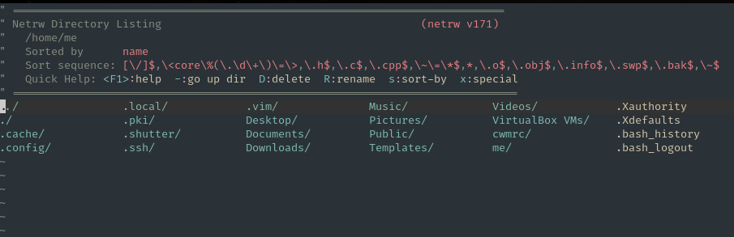

=== PDF document viewer with Zathura

It's possible to view PDFs with your browser, but a dedicated PDF viewer
can be more convenient.

[source, bash]
....
sudo dnf install zathura zathura-plugins-all
sudo dnf install zathura-fish-completion
....

Some of the key bindings are the same as Vim, with the basics as:

[square]
* j = down
* k = up
* g = top of document
* G = bottom of document
* minus = zoom in
* plus = zoom out
* equals = original size
* q = quit

Viewing a PDF is as easy as:

[source, bash]
....
zathura <name of pdf>
....

=== Other applications

Use of other packages can be seen in the screenshots, and they are:

[disc]
* chromium - browser
* exa - a modern replacement for ls
* feh - wallpaper launcher
* xclip - copy between the clipboard and the primary selection
* git - version control
* sysstat - for the sar utility
* redshift - adjusts the color temperature of your screen
* flameshot - for screenshots

Install those from DNF

[source, bash]
....
sudo dnf install chromium exa feh xclip vim-X11 git sysstat redshift flameshot
....

So using xsel or xclip you can copy selections as follows:

[source, bash]
....
xsel -o --primary| xsel -i --clipboard

xclip -o -selection primary| xclip -i -selection clipboard
....

Flameshot can be used like this:

[source, bash]
....
flameshot gui
....

=== Other configurations

==== Enhance the touchpad

If you are using a laptop, then the touchpad may not have full
functionality. For example, a drag selection is possible, but a
double-tap selection is not. So to enable a double-tap selection, create
the following file as the root user:
/etc/X11/xorg.conf.d/10-touchpad.conf

[source]
....
Section "InputClass"
    Identifier "tap-by-default"
    Driver "libinput"
    Option "Tapping" "on"
EndSection
....

==== Rectify any screen tearing and freezing

If you are using the native X11 drivers for your GPU, then it's possible
you may encounter abnormal video. The same problems may not exist with
the vendor supplied drivers.

For the native X11 drivers, you may experience screen tearing and
freezing for the Intel GPU that you're using. If so, then try the
following.

Create the following file as the root user:
/etc/X11/xorg.conf.d/20-intel.conf

[source]
....
Section "Device"
    Identifier  "Intel Graphics"
    Driver      "intel"
    # stop screen tearing
    Option "TearFree" "true"
    Option "TripleBuffer" "true"
    # stop screen freezing
    Option "DRI" "2"
EndSection
....

==== Package management with DNF

Optimise dnf for performance, by adding the following to
/etc/dnf/dnf.conf

[source]
....
max_parallel_downloads=10
fastestmirror=True
....

==== X11 startx configuration

Can use ~/.xinitrc to start the default the applications, before starting CWM:

[source, bash]
....
xrandr --output VGA-0 --auto

#feh --no-fehbg --bg-fill --randomize /usr/share/backgrounds/wallpapers-master&
#Fedora wallpaper is here:
feh --no-fehbg --bg-fill /usr/share/backgrounds/images/default-16_10.png&

picom&

#uncomment to execute by default
#polybar example&

dunst&

redshift -l manual -l -34.43:150.85 -t 6500:3000&

exec cwm
....

Now start the Calm Window Manager with:

[source, bash]
....
startx
....
