# The Calm Window Manager (CWM) - a minimalist floating window manager that also tiles

## ***** still a work-in-progress *****

This repository showcases configuration of the Calm Window Manager (CWM) to keep the minimal asthetic, but at the same time make more practical.

[https://github.com/leahneukirchen/cwm](https://github.com/leahneukirchen/cwm)

CWM is a floating window manager, and if configured correctly can:
 * float windows by default.
 * snap the floating windows into a tiling configuration. eg either horizontal master/stack, or vertical master/stack.
 * snapped windows can have gaps between the windows.
 * minimise the use of the mouse or touchpad. eg use the keyboard to launch applications.

Also add 3rd-party status bars. eg Polybar.


There is also a built-in application launcher, but also it's easy to add 3rd-party lanchers and status bars.

As CWM doesn't feature multi-monitor support, the ideal use-case is that you are just using a sigle monitor.


## Screenshots of floating windows that are snapped into tiles

To create a few terminal windows, use alt+cntrl+enter for each terminal.

For example, 4 windows.

Then alt+cntrl+minus to tile the 4 windows.

Then in the tiled layout, to switch the active window (in the non-primary) with the primary position - simply alt-cntrl-minus again.

### Without a Polybar:

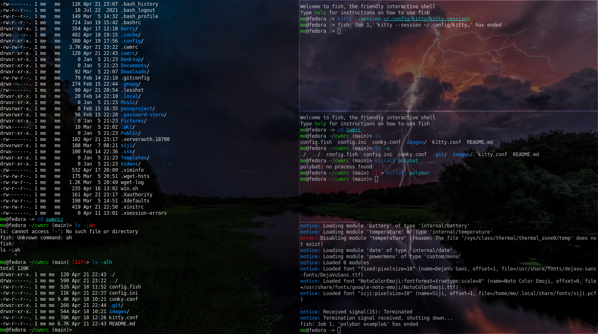

Use alt+cntrl+enter to create another terminal.

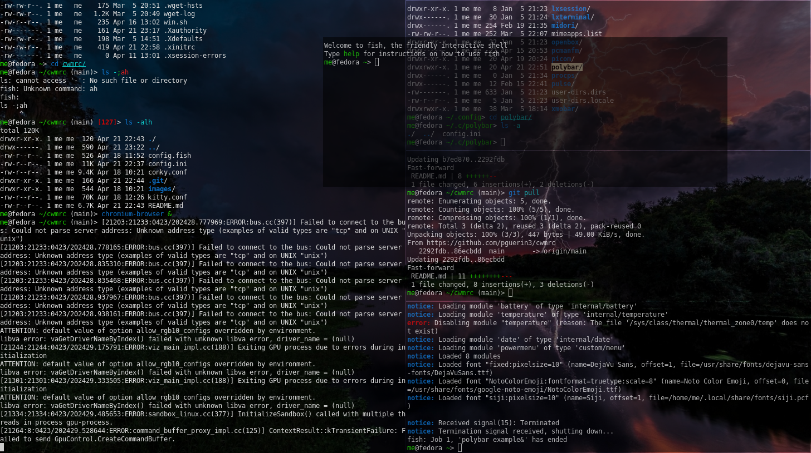


Then alt+cntrl+minus to tile the 4 windows with the focused window placed in the master position.

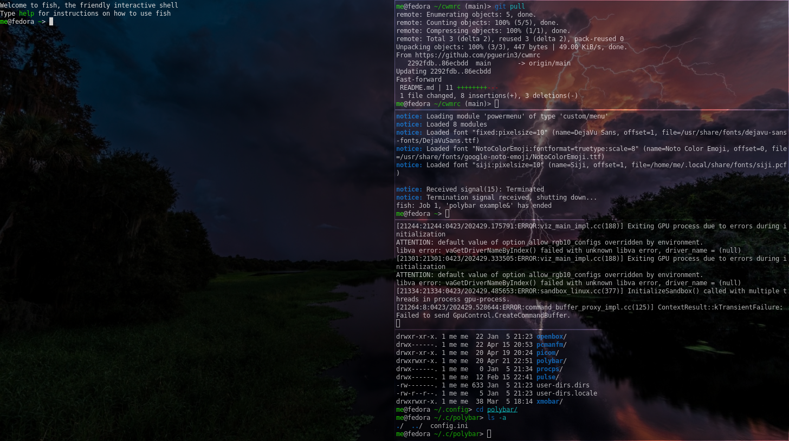


## Screenshots of floating windows (without tiling)

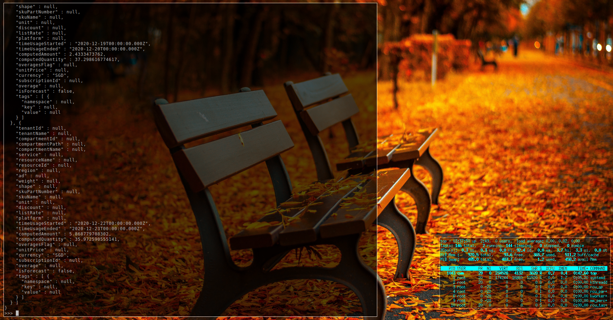


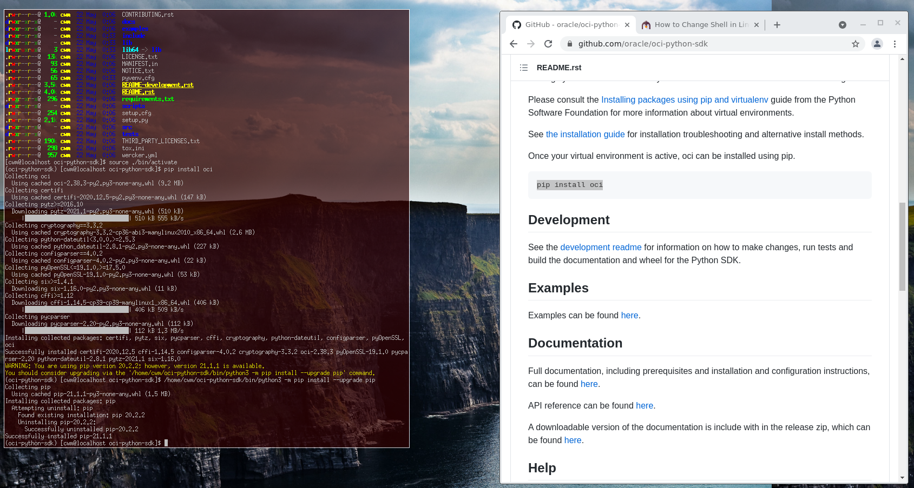
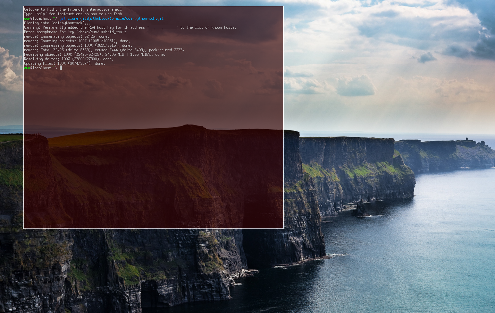
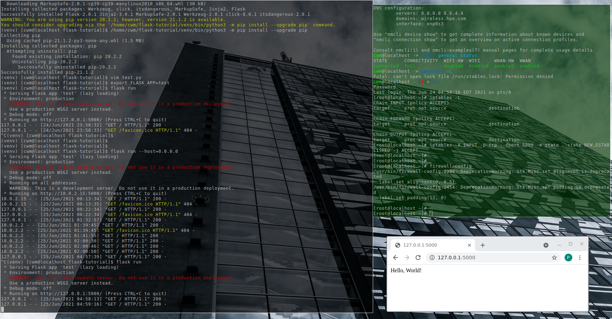
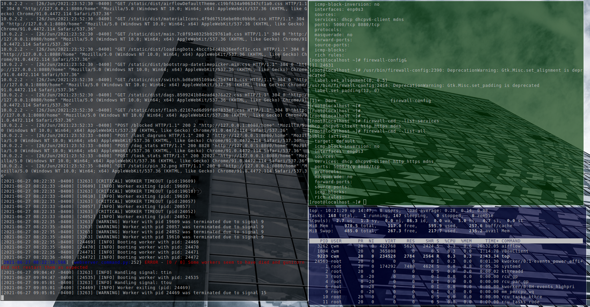


## Screenshots with the native application launcher

The application laucher can be run with a mouse click.

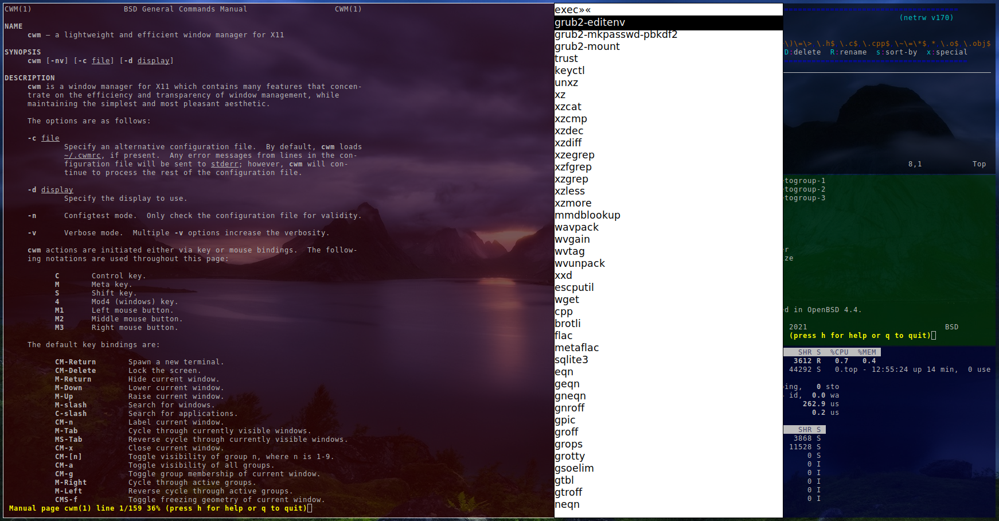
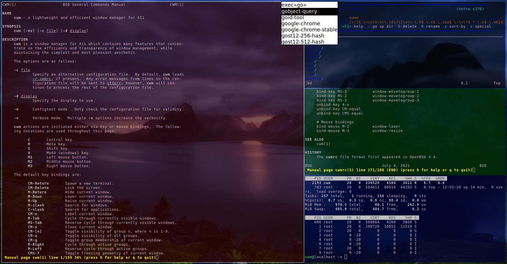

Or you may run applications from the command line. For example:

```
chromium-browser&
```


# Installation of CWM

Most Linux distributions have the CWM in their repository.
So installing CWM is extremely easy.
For example, to install in Fedora:
```
# dnf install cwm 
```

FreeBSD also has CWM in their repository, and is installed as follows:
```
# pkg install cwm
```

The ~/.cwmrc configuration file used in the screen shots is similar to this:

```
# these fonts are for the menu
fontname fixed-13

vtile 50
htile 50
gap 0 0 0 0
color activeborder red
color inactiveborder black
snapdist 3

autogroup 1 kitty,kitty
autogroup 2 urxvt,URxvt
autogroup 3 gvim,Gvim
autogroup 4 chromium-browser,Chromium-browser
autogroup 5 pcmanfm,Pcmanfm

bind-key M-1 group-toggle-1
bind-key M-2 group-toggle-2
bind-key M-3 group-toggle-3
bind-key M-4 group-toggle-4
bind-key M-5 group-toggle-5
bind-key M-6 group-toggle-6
bind-key M-7 group-toggle-7
bind-key M-0 group-toggle-all

bind-key CM-Return	kitty
bind-key CM-minus	window-vtile
bind-key CMS-minus	window-htile

ignore polybar

# for the native application menu
command urxvt	"urxvt"
```


# Install applications

## Urxvt terminal configuration file
```
# dnf install rxvt-unicode 
```
Create a ~/.Xdefaults file for the configuration of the urxvt terminal.
Place the following configuration in it:
```
URxvt.scrollBar: off
URxvt.secondaryScroll: off
URxvt.depth: 32
URxvt.background: rgba:0000/0000/0000/aaaa
URxvt.foreground: [100]grey
URxvt.font: xft:monospace:pixelsize=12
URxvt.geometry: 132x50
```

note 1 - as urxvt is configured without scroll bars, use shift-pageup to scroll up, and shift-pagedown to scroll down. 
note 2 - the +ssr parameter of urxvt turns off secondary screen scroll, so for example text inside the VIM editor will not be shown in the primary window after VIM is exited.


## The Kitty terminal
Kitty can create a default configuration file in ~/.config/kitty/kitty.conf.
(auto install the kitty.conf by using ctrl+shft+f2)
Or you can maually create a configuration file yourself.

Then you can add deviations to the head of the file similar to as follows:
```
remember_window_size yes
hide_window_decorations yes
background_opacity 0.7
dynamic_background_opacity yes
scrollback_fill_enlarged_window yes
focus_follows_mouse yes
font_size 9
enable_audio_bell no
visual_bell_duration 0.1
```


## The Fish shell
The Fish shell has syntax highlighting. Install the Fish shell as follows:

```
# dnf install fish 
```

The ~/.config/fish/config.fish file is like this:
```
export LESS_TERMCAP_mb=(printf '\e[01;31m') # enter blinking mode - red
export LESS_TERMCAP_md=(printf '\e[01;35m') # enter double-bright mode - bold, magenta
export LESS_TERMCAP_me=(printf '\e[0m') # turn off all appearance modes (mb, md, so, us)
export LESS_TERMCAP_se=(printf '\e[0m') # leave standout mode    
export LESS_TERMCAP_so=(printf '\e[01;33m') # enter standout mode - yellow
export LESS_TERMCAP_ue=(printf '\e[0m') # leave underline mode
export LESS_TERMCAP_us=(printf '\e[04;36m') # enter underline mode - cyan
```

Note - same what may be found in a Bash configuration file except the $ is removed.


## Window transparency with Picom

Transparency in the terminal is performed by either Compton or Picom:

```
# dnf install picom
```


## Status bar with Polybar

Status bar can be provided by Polybar:
```
# dnf install polybar
```
There is an example config file installed by default: /usr/share/doc/polybar/config

However this file can be copied to: ~/.config/polybar/config.ini

You'll need to edit the file to remove any components that you don't want to use.

Also you may need to install the right fonts (eg siji, and NotoColorEmoji) for the Polybar config file, and then ensure the config.ini refers to it.
```
font-0 = fixed:pixelsize=10;1
;font-1 = unifont:fontformat=truetype:size=8:antialias=false;0
font-1 = NotoColorEmoji:fontformat=truetype:scale=8;0
font-2 = siji:pixelsize=10;1
```

### Tiled windows with a Polybar (top right corner):

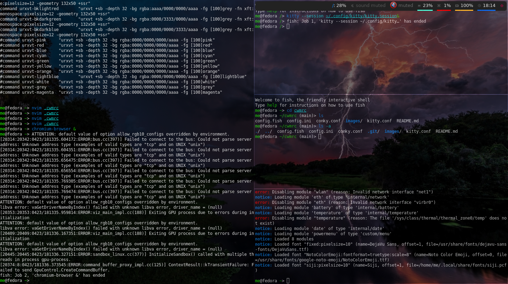


## Other applications

Use of other packages can be seen in the screenshots, and they are:
 + chromium browser
 + exa - a modern replacement for ls
 + feh wallpaper launcher
 + xclip - copy between the clipboard and the primary selection
 + git
 + sysstat - for the sar utility

```
# dnf install chromium exa feh xclip neovim vim-X11 git sysstat 
```


## X11 configurations
Can use ~/.initrc to call the applications
```
xrandr --output VGA-0 --auto
feh --no-fehbg --bg-fill ~/Downloads/467642.jpg&
#feh --no-fehbg --bg-fill --randomize /usr/share/backgrounds/wallpapers-master&
picom&
polybar example&
exec cwm
```

### Enhance the touchpad
If you are using a laptop, then the touchpad may not have full functionality.
For example, a drag selection is possible, but a double-tap selection is not.
So to enable a double-tap selection, create the following file: /etc/X11/xorg.conf.d/10-touchpad.conf
```
Section "InputClass"
	Identifier "tap-by-default"
	Driver "libinput"
	Option "Tapping" "on"
EndSection
```

### Rectify any screen tearing and freezing
If you are experiencing screen tearing and freezing for the Intel GPU that you're using then try the following.
Create the file: /etc/X11/xorg.conf.d/20-intel.conf
```
Section "Device"
	Identifier	"Intel Graphics"
	Driver		"intel"
	# stop screen tearing
	Option "TearFree" "true"
	Option "TripleBuffer" "true"
	# stop screen freezing
	Option "DRI" "2"
EndSection
```


## Shutdown, Reboot, and Suspend

As systemd is used, managing the host can be achieved with the following commands:

```
systemctl suspend
```

```
systemctl reboot
```

```
systemctl poweroff
```

