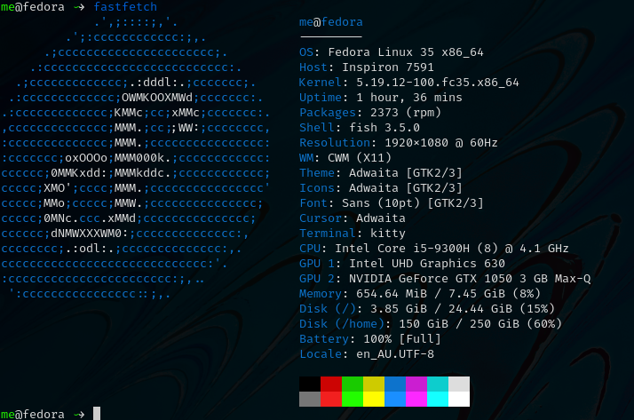
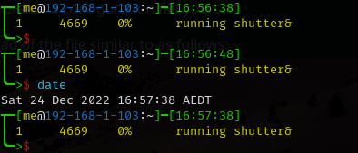
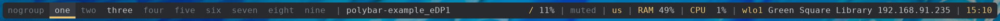
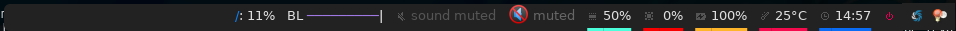

# The Calm Window Manager (CWM) - a minimalist floating window manager that also tiles

This repository showcases configuration of the Calm Window Manager (CWM) to keep the minimal asthetic, but at the same time make more practical.

CWM is a minimalist floating window manager:
 * float windows by default.
 * snap any window into a corner, or edge of the screen.
 * snap the floating windows into a tiling configuration. eg either horizontal master/stack, or vertical master/stack.
 * retain gaps between the windows and the edge of the screen.

Also there is also a native application launcher that you can drive with the mouse or touchpad. eg use the keyboard to launch applications.

If the native application launcher is not to your liking, then it's easy to add 3rd-party lanchers and status bars. eg Polybar.

As CWM doesn't feature multi-monitor support, the ideal use-case is that you are just using a single monitor.

The install instructions below are for Fedora....


## Screenshots of floating windows that are snapped into tiles

To create a few terminal windows, use alt+cntrl+enter for each terminal.

### Without a Polybar:

For example, 4 floating windows can be snapped into tiles.

Then alt+cntrl+minus to tile the 4 windows, into a master window on the left and 3 stacked windows on the right.

Then in the tiled layout, to switch the active window (in the non-primary) with the primary position - simply alt-cntrl-minus again.


Use alt+cntrl+enter to create another terminal.

It will float on top of the 4 other windows for a total of 5 windows.


Then alt+cntrl+minus to restacck the 5 windows into the tiled layout with the focused window placed in the master position on the left.


So now 4 windows have been snapped into the stack on the right, and the focused window at that time was snapped into the master position on the left.


## Screenshots of floating windows (without tiling)


## Screenshots with the native application launcher

The application laucher can be run with a mouse click.


Or you may run applications from the command line. For example:

```
$ chromium-browser&
```
or to ignore any run-time errors:
```
$ chromium-browser > /dev/null 2>&1 &
```
Add the disown command to detach the application from the terminal:
```
$ chromium-browser > /dev/null 2>&1 &; disown
```

As systemd is used, managing the host from the shell can also be achieved with the following commands:

```
systemctl suspend
```

```
systemctl reboot
```

```
systemctl poweroff
```


# Installation and configuration of CWM
The official repo for CWM is here:

[https://github.com/leahneukirchen/cwm](https://github.com/leahneukirchen/cwm)

Most Linux distributions have the CWM in their repository.
So installing CWM is extremely easy.
For example, to install in Fedora:
```
$ sudo dnf install cwm 
```

FreeBSD also has CWM in their repository, and is installed as follows:
```
$ sudo pkg install cwm
```

The ~/.cwmrc configuration file used in the screen shots is similar to this:

```
# these fonts are for the application launcher menu
fontname fixed-13

vtile 50
htile 50
gap 1 1 1 1
color activeborder red
color inactiveborder black
snapdist 3

bind-key CM-Return	"kitty"
bind-key CM-minus	window-vtile
bind-key CMS-minus	window-htile

autogroup 1 kitty,kitty
autogroup 2 urxvt,URxvt
autogroup 3 brave-browser, Brave-browser
autogroup 4 chromium-browser,Chromium-browser
autogroup 5 pcmanfm,Pcmanfm
autogroup 6 "VirtualBox Manager", "VirtualBox Manager"

bind-key M-1 group-toggle-1
bind-key M-2 group-toggle-2
bind-key M-3 group-toggle-3
bind-key M-4 group-toggle-4
bind-key M-5 group-toggle-5
bind-key M-6 group-toggle-6
bind-key M-7 group-toggle-7
bind-key M-0 group-toggle-all

ignore polybar

# for the native application menu
command urxvt	"urxvt"
command kitty	"kitty"
```

Inspect the CWM manual for all the default key bindings:
```
$ man cwm
```
Then inspect the CWM configuration manual for the other possibilities for the ~/.cwmrc file:
```
$ man cwmrc
```


# Applications


## System information with Fastfetch
Also as an option, install Fastfetch for some bling when a terminal is started.
The source is here:
[https://github.com/LinusDierheimer/fastfetch](https://github.com/LinusDierheimer/fastfetch)

Fastfetch is present in the Fedora repo:
```
$ sudo dnf install fastfetch
```
This is what Fastfetch looks like on Fedora.




## The virtual terminal with Urxvt
Urxvt is present in the Fedora repo:
```
$ sudo dnf install rxvt-unicode 
```
My urxvt terminal is configured without scroll bars. Also use shift-pageup to scroll up, and shift-pagedown to scroll down. 
The +ssr parameter of urxvt turns off secondary screen scroll, so for example text inside the Vim editor will not be shown in the primary window after Vim has exited. The same setting is set with secondaryScroll.

Create a ~/.Xdefaults file for the configuration of the urxvt terminal.
Place the following configuration in it:
```
URxvt.scrollBar: off
# turn off the secondary screen scrolling for a pager. eg less.
URxvt.secondaryScroll: off
URxvt.depth: 32
URxvt.background: rgba:0000/0000/0000/aaaa
URxvt.foreground: [100]grey
URxvt.font: xft:monospace:pixelsize=12
URxvt.geometry: 132x50
URxvt.visualBell: on
```


## The virtual terminal with Kitty
Kitty is in the Fedora repo: 
```
sudo dnf install kitty
```
My Kitty terminal is configured without scroll bars. Also use cntrl-shift-pageup to scroll up, and cntrl-shift-pagedown to scroll down. 
In Kitty, secondary screen scrolling is off by default.

Also define the font and font size you want to use with the Fish shell.
In the comfig above I'm using FiraCode:
[https://github.com/tonsky/FiraCode](https://github.com/tonsky/FiraCode)

Kitty can autocreate a default configuration file in ~/.config/kitty/kitty.conf by using ctrl+shft+f2.
Or you can maually create a configuration file yourself in the same location.

Then you can add configurations to the head of the file similar to as follows:
```
remember_window_size no
initial_window_width  1000
initial_window_height 1000
hide_window_decorations yes
background_opacity 0.9
dynamic_background_opacity yes
scrollback_fill_enlarged_window yes
focus_follows_mouse yes
# dnf install fira-code-fonts
font_family Fira Code Regular
font_size 10
enable_audio_bell no
visual_bell_duration 0.1
editor vim
```


## The Fish shell
The Fish shell has syntax highlighting. Install the Fish shell as follows:

```
$ sudo dnf install fish 
```
The ~/.config/fish/config.fish file is like this:
```
if status is-interactive
    # Commands to run in interactive sessions can go here
    # add color to the less pager in Fish, not Bash does this differently using export.
    set -gx LESS_TERMCAP_mb (printf '\e[01;31m') # enter blinking mode - red
    set -gx LESS_TERMCAP_md (printf '\e[01;35m') # enter double-bright mode - bold, magenta
    set -gx LESS_TERMCAP_me (printf '\e[0m') # turn off all appearance modes (mb, md, so, us)
    set -gx LESS_TERMCAP_se (printf '\e[0m') # leave standout mode
    set -gx LESS_TERMCAP_so (printf '\e[01;33m') # enter standout mode - yellow
    set -gx LESS_TERMCAP_ue (printf '\e[0m') # leave underline mode
    set -gx LESS_TERMCAP_us (printf '\e[04;36m') # enter underline mode - cyan
end
#Note - same what may be found in a Bash configuration file except the $ is removed.

#Add your favourite keyboard layout here for X11
#setxkbmap -layout us -variant <name>

# Now it's your choice of fastfetch for every terminal
#fastfetch
# or fastfetch just for the 1st terminal (fish syntax)
set -l LIVE_COUNTER $(ps a -o tty $(pgrep $(echo $TERM)) | uniq --unique | wc -l)
if [ $LIVE_COUNTER -eq 1 ]
     fastfetch
end
```

The theme and prompt can also be selected from the native configurations.
Display a list of themes with:
```
fish_config theme show
```
Then choose a theme like this:
```
fish_config theme choose 'ayu Dark'
fish_config theme save 'ayu Dark'
```
Similarly display a list of prompts with:
```
fish_config prompt show
```
And choose a prompt like this:
```
fish_config prompt choose nim
fish_config prompt save
```




## Window transparency with Picom

Transparency in the terminal is enabled in the terminal, but the transparency it-self is performed by Picom:

```
$ sudo dnf install picom
```


## Status bar with Polybar

Status bar can be provided by Polybar:
```
$ sudo dnf install polybar
```
In the Fedora repo there is an example config file installed by default: /usr/share/doc/polybar/examples/config.ini

However this file can be copied to: ~/.config/polybar/config.ini
```
$ mkdir ~/.config/polybar/
$ cp /usr/share/doc/polybar/examples/config.ini ~/.config/polybar/config.ini
```

By default, this is what it looks like (need the prerequisite fonts installed - see below)



However, the bar is easy to customise to your liking, and edit the configuration file to remove any components that you don't want to use.

For Fedora, you may need to install the right fonts (eg siji, and NotoColorEmoji) for the Polybar config file.
Also need the xset app for the siji font below:
```
$ sudo dnf install xset
```
Then follow the instructions in github to install the siji font:
```
https://github.com/stark/siji
```

Now ensure the Polybar config.ini file refers to the google-noto-emoji font:
```
font-0 = fixed:pixelsize=10;1
;font-1 = unifont:fontformat=truetype:size=8:antialias=false;0
;then edit the font-1 line in the config look like this (uses the google-noto-emoji font)
font-1 = NotoColorEmoji:fontformat=truetype:scale=8;0
font-2 = siji:pixelsize=10;1
```
Then run the example bar with:
```
$ polybar example&
```
Or place the above command in the CWM configuration file (shown below).

Now the Polybar will look something like this:




### Tiled windows with a Polybar (top right corner):

An modified version of the example Polybar, with the bar at 50% of the screen width, is shown below:


## Other applications

Use of other packages can be seen in the screenshots, and they are:
 + chromium browser
 + exa - a modern replacement for ls
 + feh wallpaper launcher
 + xclip - copy between the clipboard and the primary selection
 + git
 + sysstat - for the sar utility
 + vim - text editor

```
$ sudo dnf install chromium exa feh xclip neovim vim-X11 git sysstat 
```


## X11 startx configuration
Can use ~/.initrc to start the default the applications, before starting CWM:
```
xrandr --output VGA-0 --auto
#feh --no-fehbg --bg-fill --randomize /usr/share/backgrounds/wallpapers-master&
#Fedora wallpaper is here:
feh --no-fehbg --bg-fill /usr/share/backgrounds/images/default-16_10.png&
picom&
#uncomment to execute by default
#polybar example&
exec cwm
```
Now start the CWM with:
```
startx
```


## Optional - X11 configurations

### Enhance the touchpad
If you are using a laptop, then the touchpad may not have full functionality.
For example, a drag selection is possible, but a double-tap selection is not.
So to enable a double-tap selection, create the following file as the root user: /etc/X11/xorg.conf.d/10-touchpad.conf
```
Section "InputClass"
	Identifier "tap-by-default"
	Driver "libinput"
	Option "Tapping" "on"
EndSection
```

### Rectify any screen tearing and freezing
If you are using the native X11 drivers for your GPU, then it's possible you may encounter abnormal video. The same problems may not exist with the vendor supplied drivers.

For the native X11 drivers, you may experience screen tearing and freezing for the Intel GPU that you're using.
If so then try the following.
Create the following file as the root user: /etc/X11/xorg.conf.d/20-intel.conf
```
Section "Device"
	Identifier	"Intel Graphics"
	Driver		"intel"
	# stop screen tearing
	Option "TearFree" "true"
	Option "TripleBuffer" "true"
	# stop screen freezing
	Option "DRI" "2"
EndSection
```


