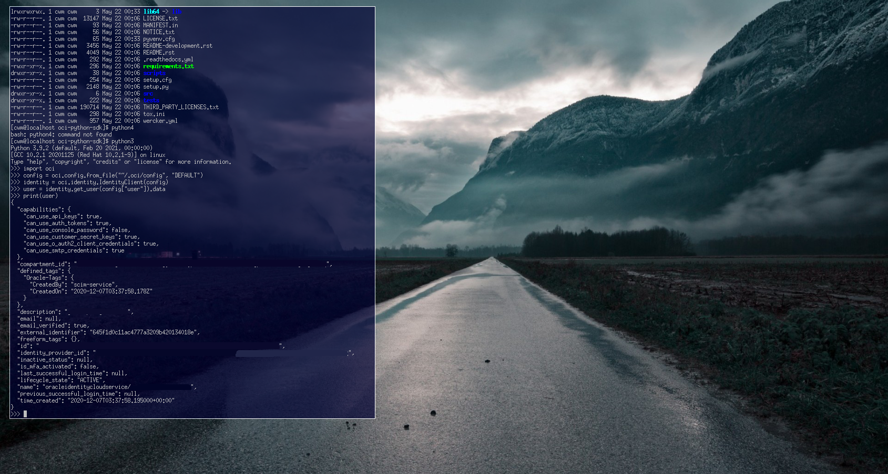
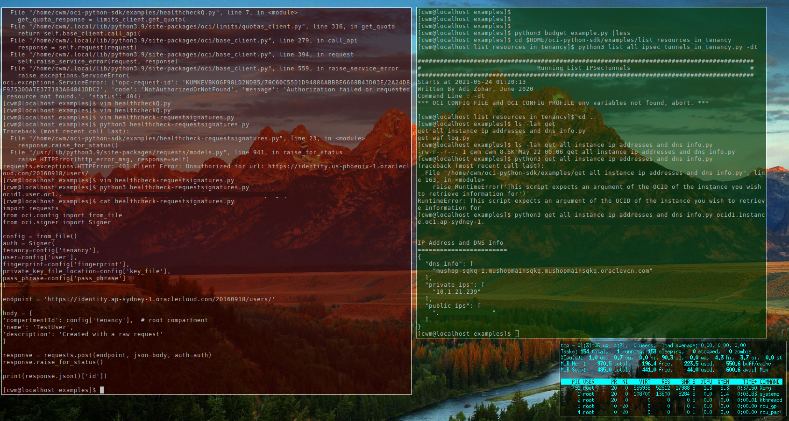

# The Calm Window Manager (CWM) configuration

This repository showcases screenshots of the Calm Window Manager (CWM)

[CWM](https://github.com/leahneukirchen/cwm)

However, as CWM is extremely minimalistic, other applications are used to obtain extra bling.


## Screenshots of CWM






## Installation of CWM

Most Linux distributions have the CWM in their repository.
So installing CWM is extremely easy. For example:
```
# dnf install cwm 
```

FreeBSD also has CWM in their repository, and is installed as follows:
```
# pkg install cwm
```


## Other packages used

Use of other packages can be seen in the screenshots, and they are:
 + fish shell
 + chromium browser
 + urxvt terminal
 + exa - a modern replacement for ls
 + feh wallpaper launcher

```
# dnf install fish chrome rxvt-unicode exa feh
```

Transparency in the terminal is performed by Compton:
```
# dnf install compton
```


## Configuration files

### Bash Configuration file

The ~/.bash_profile file is like this:
```
feh --no-fehbg --bg-fill --randomize /usr/share/backgrounds/wallpapers-master&
compton&
```

### CWM Configuration file

The ~/.cwmrc is like this:

``
# these fonts are for the menu
#fontname "sans-serif:pixelsize=16"
#fontname "monospace:pixelsize=15"
#fontname "dejavu sans mono:size=7"
fontname fixed-13

moveamount 10	# granularity of finest movement

bind-key CM-Return	"urxvt"
# suspect pointer doesn't work in VM due to special mouse support
#bind-key 4-k	pointer-move-up
#bind-key 4-j	pointer-move-down
#bind-key 4-l	pointer-move-right
#bind-key 4-h	pointer-move-left

# applications
command xscreensaver	"xscreensaver"
command xclock		"xclock"
command top		"urxvt +sb -depth 32 -bg rgba:0000/0000/0000/6666 -fg [100]cyan -e top"
command urxvt-bkblack	"urxvt +sb -depth 32 -bg rgba:0000/0000/0000/aaaa -fg [100]grey -fn xft:monospace:pixelsize=12 -geometry 132x50 +ssr"
command urxvt-bkdarkred	"urxvt +sb -depth 32 -bg rgba:3333/0000/0000/aaaa -fg [100]grey -fn xft:monospace:pixelsize=12 -geometry 132x50 +ssr"
command urxvt-bklightred	"urxvt +sb -depth 32 -bg rgba:aaaa/0000/0000/aaaa -fg [100]grey -fn xft:monospace:pixelsize=12 -geometry 132x50 +ssr"
command urxvt-bkdarkgreen	"urxvt +sb -depth 32 -bg rgba:0000/3333/0000/aaaa -fg [100]grey -fn xft:monospace:pixelsize=12 -geometry 132x50 +ssr"
command urxvt-bkdarkblue	"urxvt +sb -depth 32 -bg rgba:0000/0000/3333/aaaa -fg [100]grey -fn xft:monospace:pixelsize=12 -geometry 132x50 +ssr"

```

note 1 - as urxvt is configured without scroll bars, use shift-pageup to scroll up, and shift-pagedown to scroll down. 
note 2 - the +ssr parameter of urxvt turns off secondary screen scroll, so for example text inside the VIM editor will not be shown in the primary window after VIM is exited.


