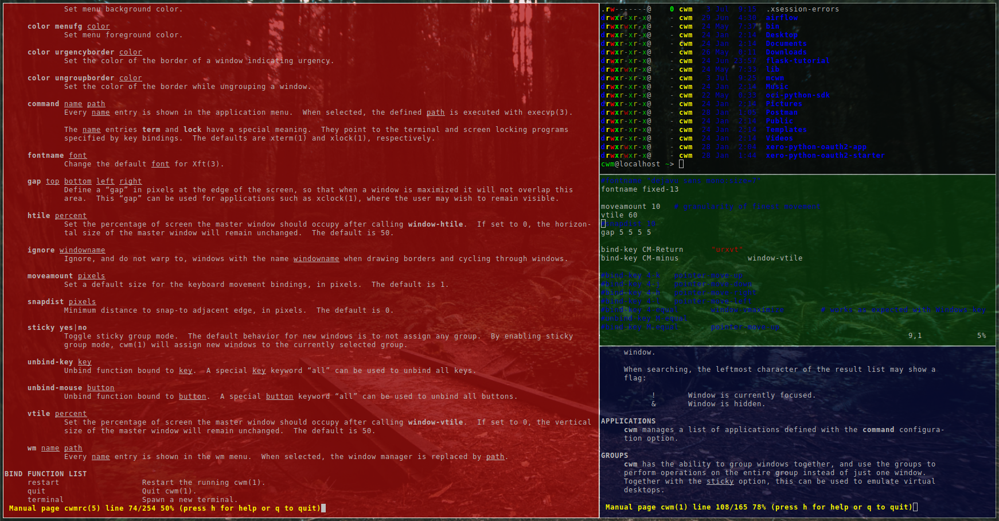
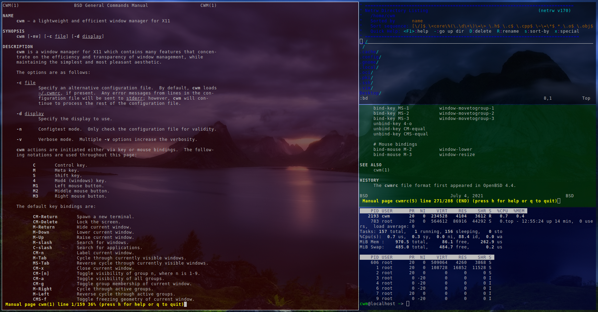

# The Calm Window Manager (CWM) configuration

This repository showcases screenshots of the Calm Window Manager (CWM)

[CWM](https://github.com/leahneukirchen/cwm)

CWM is a floating window manager, that can also do tiling.

There is also a built-in application launcher, but also it's easy to add 3rd-party lanchers and status bars.


## Screenshots of floating windows that are tiled windows

To create a few terminal windows, use alt+cntrl+enter for each terminal.
Then alt+cntrl+minus to tile.





## Screenshots with application launcher

The application laucher can be run with a mouse click.
Or you may run applications from the command line.

```
chromium-browser&
```


## Screenshots of floating windows


## Enhance the touchpad
If you are using a laptop, then the touchpad may not have full functionality.
For example, a drag selection is possible, but a double-tap selection is not.
So to enable a double-tap selection, create the following file: /etc/X11/xorg.conf.d/10-touchpad.conf
```
Section "InputClass"
	Identifier "tap-by-default"
	Driver "libinput"
	Option "Tapping" "on"
EndSection
```

## Rectify any screen tearing and freezing
If you are experiencing screen tearing and freezing for the Intel GPU that you're using then try the following.
Create the file: /etc/X11/xorg.conf.d/20-intel.conf
```
Section "Device"
	Identifier	"Intel Graphics"
	Driver		"intel"
	# stop the tearing
	Option "TearFree" "true"
	Option "TripleBuffer" "true"
	# stop screen freezing
	Option "DRI" "2"
EndSection
```


## Installation of CWM

Most Linux distributions have the CWM in their repository.
So installing CWM is extremely easy. For example:
```
# dnf install cwm 
```

FreeBSD also has CWM in their repository, and is installed as follows:
```
# pkg install cwm
```


## Other packages used

Use of other packages can be seen in the screenshots, and they are:
 + fish shell - has syntax highlighting
 + chromium browser
 + urxvt terminal
 + kitty terminal
 + exa - a modern replacement for ls
 + feh wallpaper launcher
 + xclip - copy between the clipboard and the primary selection
 + git
 + sysstat - for the sar utility

```
# dnf install fish chromium rxvt-unicode exa feh xclip neovim vim-X11 git sysstat 
```

Transparency in the terminal is performed by Compton or Picom:
```
# dnf install picom
```

Status bar can be provided by Polybar:
```
# dnf install polybar
```
There is an example config file installed by default: /usr/share/doc/polybar/config
However this file can be copied to your home, and then installed in: ~/.config/polybar/config
Also you may need to install the right font (eg siji) for the Polybar config file.


## Configuration files

### Kitty configuration file
Kitty can create a default configuration file in ~/.config/kitty/kitty.conf.
(auto install the kitty.conf by using ctrl+shft+f2)
Then you can add deviations to the head of the file similar to as follows:
```
remember_window_size yes
hide_window_decorations yes
background_opacity 0.7
dynamic_background_opacity yes
scrollback_fill_enlarged_window yes
focus_follows_mouse yes
font_size 9
enable_audio_bell no
visual_bell_duration 0.1
```

### urxvt terminal configuration file
Create a ~/.Xdefaults file for the configuration of the urxvt terminal.
Place the following configuration in it:
```
URxvt.scrollBar: off
URxvt.secondaryScroll: off
URxvt.depth: 32
URxvt.background: rgba:0000/0000/0000/aaaa
URxvt.foreground: [100]grey
URxvt.font: xft:monospace:pixelsize=12
URxvt.geometry: 132x50
```

### Bash configuration file

The ~/.bash_profile file is like this:
```
feh --no-fehbg --bg-fill --randomize /usr/share/backgrounds/wallpapers-master&
compton&
```


### Fish configuration file

The ~/.config/fish/config.fish file is like this:
```
export LESS_TERMCAP_mb=(printf '\e[01;31m') # enter blinking mode - red
export LESS_TERMCAP_md=(printf '\e[01;35m') # enter double-bright mode - bold, magenta
export LESS_TERMCAP_me=(printf '\e[0m') # turn off all appearance modes (mb, md, so, us)
export LESS_TERMCAP_se=(printf '\e[0m') # leave standout mode    
export LESS_TERMCAP_so=(printf '\e[01;33m') # enter standout mode - yellow
export LESS_TERMCAP_ue=(printf '\e[0m') # leave underline mode
export LESS_TERMCAP_us=(printf '\e[04;36m') # enter underline mode - cyan
```

Note - same as bash except the $ is removed


### Neovim configuration file


### CWM configuration file

The ~/.cwmrc is similar to this:

```
# these fonts are for the menu
#fontname "sans-serif:pixelsize=16"
#fontname "monospace:pixelsize=15"
#fontname "dejavu sans mono:size=7"
fontname fixed-13

vtile 50
htile 50
gap 0 0 0 0
color activeborder red
color inactiveborder black
snapdist 3

unbind-mouse all

bind-key CM-Return	kitty
bind-key CM-minus	window-vtile
bind-key CMS-minus	window-htile

autogroup 1 kitty,kitty
autogroup 2 urxvt,URxvt
autogroup 3 gvim,Gvim
autogroup 4 chromium-browser,Chromium-browser
autogroup 5 pcmanfm,Pcmanfm
autogroup 6 "VirtualBox Manager, VirtualBox Manager"
autogroup 7 "VirtualBox Machine, VirtualBox Machine"

bind-key M-1 group-toggle-1
bind-key M-2 group-toggle-2
bind-key M-3 group-toggle-3
bind-key M-4 group-toggle-4
bind-key M-5 group-toggle-5
bind-key M-6 group-toggle-6
bind-key M-7 group-toggle-7
bind-key M-0 group-toggle-all

#command urxvt-bkblack	"urxvt +sb -depth 32 -bg rgba:0000/0000/0000/aaaa -fg [100]grey -fn xft:monospace:pixelsize=12 -geometry 132x50 +ssr"
```

note 1 - as urxvt is configured without scroll bars, use shift-pageup to scroll up, and shift-pagedown to scroll down. 
note 2 - the +ssr parameter of urxvt turns off secondary screen scroll, so for example text inside the VIM editor will not be shown in the primary window after VIM is exited.

### X11 startup configuration
Can use ~/.initrc to call the applications
```
xrandr --output VGA-0 --auto
feh --no-fehbg --bg-fill ~/Downloads/467642.jpg&
picom&
polybar example&
exec cwm
```

### Shutdown, Reboot, and Suspend

As systemd is used, managing the host can be achieved with the following commands:

```
systemctl suspend
```

```
systemctl reboot
```

```
systemctl poweroff
```

